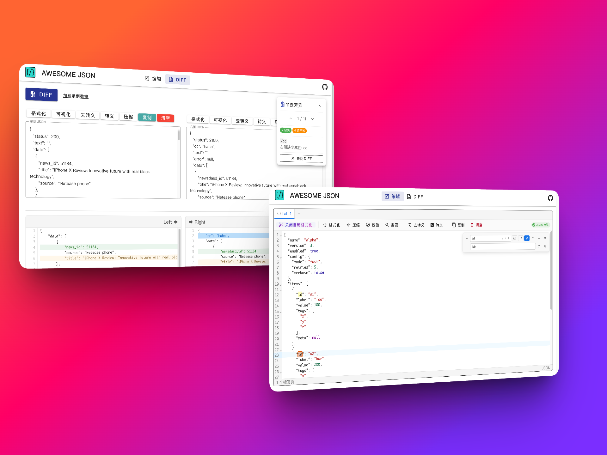

<div align="center">

# Awesome JSON

**一款优雅的在线 JSON 工具集，让 JSON 处理变得简单高效。**

基于 Vue 3 + Vuetify 3 + CodeMirror 6 构建

[](https://vuejs.org/)
[](https://vuetifyjs.com/)
[](https://codemirror.net/)
[](https://vitejs.dev/)
[](LICENSE)

**在线体验：[awesome-json.wangyj.site](https://awesome-json.wangyj.site/)**



</div>

---

## ✨ 功能特性

### 📝 JSON 编辑器

> VS Code 风格的多标签页 JSON 编辑器，专业级编辑体验。

- **多标签页** — 支持多 Tab 并行编辑，各标签页独立互不干扰
- **智能编辑器** — 基于 CodeMirror 6，提供语法高亮、括号匹配、代码折叠、自动补全
- **自动格式化** — 输入后自动美化 JSON（800ms 防抖），也可手动格式化/压缩
- **实时校验** — 输入即校验 JSON 合法性，状态栏实时反馈
- **搜索替换** — 自定义 VS Code 风格搜索面板，支持正则、大小写、全词匹配
- **转义处理** — 一键转义/去转义 JSON 字符串
- **快捷操作** — 复制、清空、折叠占位符显示 `{ ... 3 keys }` / `[ ... 5 items ]`

### 🔍 JSON Diff

> 语义级递归对比，精准定位每一处差异。

- **语义对比** — 深度递归对比 JSON 结构，而非简单文本比较
- **三种差异标记** — 🟢 缺失 · 🔴 类型不同 · 🟠 值不等
- **差异导航** — 悬浮控制面板，支持上/下跳转、按类型筛选
- **键盘快捷键** — `N` / `→` 下一个，`P` / `←` 上一个
- **JSON 可视化** — 树形结构展示，支持虚拟滚动、折叠、行号
- **示例数据** — 一键加载示例，快速体验 Diff 功能

---

## 🛠️ 技术栈

- [Vue 3](https://vuejs.org/) — Composition API + `<script setup>`
- [Vuetify 3](https://vuetifyjs.com/) — Material Design 组件库
- [CodeMirror 6](https://codemirror.net/) — 代码编辑器引擎

---

## 🚀 快速开始

### 环境要求

- Node.js >= 18
- npm >= 9

### 安装与运行

```bash
# 克隆仓库
git clone https://github.com/EthonWang/awesome-json.git
cd awesome-json

# 安装依赖
npm install

# 启动开发服务器
npm run dev
```

### 构建部署

```bash
# 构建生产版本
npm run build

# 预览构建产物
npm run preview
```

构建产物输出至 `dist/` 目录，可部署到任意静态服务器（Nginx、Vercel、Netlify、GitHub Pages 等）。

---

## 📁 项目结构

```
awesome-json/
├── public/                       # 静态资源
├── src/
│   ├── App.vue                   # 根组件（导航栏 + 路由出口）
│   ├── main.js                   # 应用入口
│   ├── router/
│   │   └── index.js              # 路由配置
│   ├── components/
│   │   ├── JsonEditor.vue        # CodeMirror 6 JSON 编辑器
│   │   ├── JsonDiff.vue          # Diff 对比结果展示
│   │   └── CustomSearchPanel.js  # 自定义搜索/替换面板
│   ├── utils/
│   │   └── jsonDiff.js           # JSON Diff 核心算法引擎
│   └── views/
│       ├── HomeView.vue          # 编辑器页面
│       └── DiffView.vue          # Diff 对比页面
├── index.html
├── package.json
└── vite.config.js
```

---

## 🤝 贡献

欢迎提交 Issue 和 Pull Request！

1. Fork 本仓库
2. 创建特性分支 (`git checkout -b feature/amazing-feature`)
3. 提交更改 (`git commit -m 'Add amazing feature'`)
4. 推送到分支 (`git push origin feature/amazing-feature`)
5. 提交 Pull Request

---

## 📄 License

[MIT](LICENSE)

---

<div align="center">

**如果觉得有用，请给个 ⭐ Star 支持一下！**

</div>
