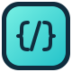
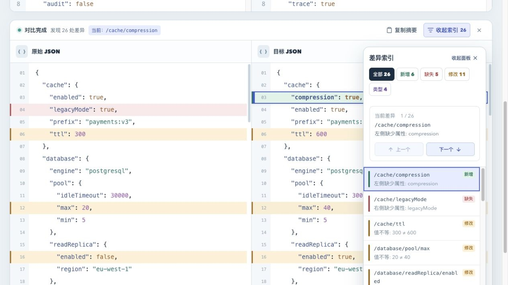
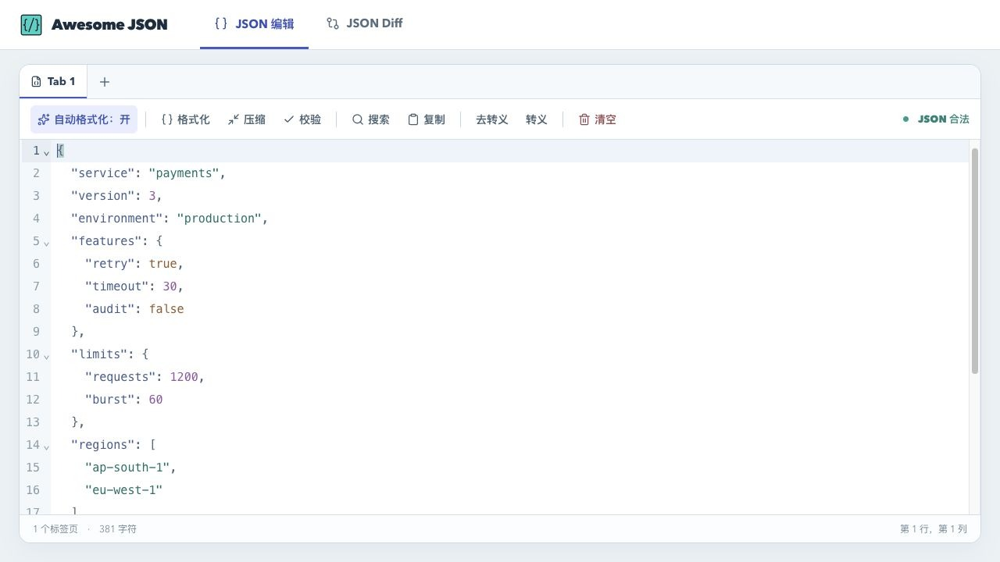

<div align="center">



# Awesome JSON

**JSON 编辑 · 格式化 · 差异对比**

面向桌面的 JSON 工具，支持多标签编辑、实时校验和按字段定位差异。

<p>
  <a href="#快速开始"><strong>快速开始</strong></a>
  &nbsp;·&nbsp;
  <a href="#界面预览">界面预览</a>
  &nbsp;·&nbsp;
  <a href="https://github.com/EthonWang/awesome-json/issues">反馈问题</a>
</p>

<p>
  
  
  
  
</p>



</div>

## 功能

| JSON 编辑 | JSON Diff |
| :--- | :--- |
| 多标签编辑，切换工作区保留当前内容 | 双栏输入，按字段递归比较对象和数组 |
| 语法高亮、括号匹配、自动补全与代码折叠 | 用四种颜色区分新增、缺失、修改和类型变化 |
| 实时校验与浮动消息提示，可开关自动格式化 | 浮动差异索引，支持收起、分类筛选和逐项跳转 |
| 格式化、压缩、复制、转义和去转义 | 两侧独立编辑，支持树形可视化查看 |
| 搜索替换，状态栏显示字符数与光标行列 | 点击差异行定位，复制差异摘要 |

JSON 的解析、格式化和对比均在浏览器内完成，无需后端服务。页面内切换会保留输入内容，**刷新或关闭页面后不会自动恢复**；编辑过内容时会尝试触发浏览器的离开提醒，请及时复制保存。

## 界面预览

### JSON 编辑器

粘贴 JSON 后，工具栏显示实时校验状态。自动格式化默认开启，有效 JSON 在停止输入约 800 毫秒后整理缩进；可以随时关闭，改用手动格式化。底部状态栏显示当前光标的行、列位置。



### JSON Diff

1. 在左右两侧分别输入原始 JSON 和目标 JSON，点击「开始对比」。
2. 通过差异索引筛选类别，点击列表或高亮代码行定位，也可使用「上一个 / 下一个」。
3. 修改输入后，点击「重新对比」更新结果；点击「清空两侧」重新开始。

Diff 页默认留空。「载入示例」提供约 100 行的嵌套配置，包含 26 处差异，可直接体验对象、数组以及类型变化的对比效果。

| 差异 | 颜色 | 含义（从原始到目标） |
| :--- | :--- | :--- |
| 新增 | 🟢 绿色 | 目标新增字段或数组元素 |
| 缺失 | 🔴 红色 | 目标缺少原始字段或数组元素 |
| 修改 | 🟠 琥珀色 | 同类型的值发生变化 |
| 类型 | 🟣 紫色 | 类型发生变化，如数字变字符串、布尔值变对象 |

对比忽略对象属性顺序，结果按属性名排序展示；数组按索引逐项比较。选中的差异额外显示蓝色边框，索引上方同步显示当前路径和变化说明。

## 快速开始

需要 **Node.js 20.19+ 或 22.12+** 和 npm。

```bash
git clone https://github.com/EthonWang/awesome-json.git
cd awesome-json
npm ci
npm run dev
```

按终端提示打开本地地址，通常为 `http://localhost:5173`。

| 命令 | 用途 |
| :--- | :--- |
| `npm run dev` | 启动开发服务 |
| `npm run build` | 生成生产构建，输出到 `dist/` |
| `npm run preview` | 在本地预览生产构建 |

### 静态部署

将 `dist/` 的内容部署到静态站点服务即可。项目使用 Hash 路由（`/#/` 和 `/#/diff`），无需为页面路由配置服务端重写。

如果部署在子路径，例如 GitHub Pages 的 `/awesome-json/`，构建时指定资源路径：

```bash
npm run build -- --base=/awesome-json/
```

剪贴板功能需要 HTTPS 或 localhost 环境，以及浏览器允许访问剪贴板。

## 快捷键

| 场景 | 快捷键 | 操作 |
| :--- | :--- | :--- |
| 编辑器 | `Ctrl / ⌘ + F` | 搜索 |
| 编辑器 | `Ctrl / ⌘ + H` | 搜索并替换 |
| 编辑器 | `Ctrl / ⌘ + Z` | 撤销 |
| Diff 结果 | `N` / `→` | 下一处差异 |
| Diff 结果 | `P` / `←` | 上一处差异 |

Diff 导航快捷键在焦点不处于输入框、按钮或弹窗内时生效，并按当前筛选结果跳转。

## 技术栈

| 技术 | 用途 |
| :--- | :--- |
| React 19 + React Router | 页面、状态和工作区路由 |
| CodeMirror 6 + `@uiw/react-codemirror` | JSON 编辑、折叠、搜索替换 |
| Radix UI | 标签页和可视化弹窗 |
| Lucide React | 界面图标 |
| `react-json-view-lite` | JSON 树形查看 |
| Vite 7 | 开发服务与生产构建 |

差异比较由项目内的递归引擎实现，界面使用 Tailwind CSS 和 shadcn/ui。

## 参与贡献

欢迎通过 [Issue](https://github.com/EthonWang/awesome-json/issues) 报告问题或提出建议，也欢迎提交 Pull Request。反馈时请附上复现步骤、浏览器版本和可公开的示例 JSON；提交代码前请运行 `npm run build`。

## UI 与样式

界面使用 Tailwind CSS 4 和 shadcn/ui，保留 Awesome JSON 的浅色主题。基础组件源码位于 `src/components/ui`：按钮通过 `variant` 和 `size` 统一外观，弹窗和标签页基于 Radix UI。`components.json` 保存 shadcn/ui 的组件配置。

- `src/styles.css`：Tailwind 入口与主题颜色映射。
- `src/styles/theme.css`：颜色、字体和全局基础规则。
- `src/lib/workspaceStyles.js`：共享容器和标题的 Tailwind 类名组合。
- `src/styles/editor.css`：CodeMirror 内部节点的专用样式。
- `src/styles/diff.css`：差异语义颜色、语法高亮和连续差异边框。
- `src/styles/viewer.css`：第三方 JSON 树的主题变量及内部节点对齐。
- `src/components/JsonTree.jsx`：JSON 树组件封装，统一鼠标与键盘展开、节点复制和焦点样式。

导航、工具栏、标签页、弹窗和响应式布局均使用组件中的 Tailwind 工具类；新增通用布局优先使用 Tailwind 工具类，基础交互优先复用 `ui` 组件。CodeMirror、JSON 树和连续差异边框等特殊场景保留专用 CSS，避免在页面中重复定义按钮样式。

字体规范统一定义在 `src/styles/theme.css`，并由 Tailwind 的语义字号类引用：`text-body`（14px 正文）、`text-action`（13px 按钮）、`text-caption`（12px 辅助信息）、`text-code`（15px 等宽代码）、`text-title`（16px 标题）、`text-brand`（20px 品牌）。辅助文字使用统一的 `text-muted-foreground`，在浅色背景上保持至少 4.5:1 对比度。常规文字使用默认字重，操作与标题使用 600，重点信息使用 700。编辑器与搜索面板复用同一字体变量，不再通过 CSS 强制覆盖编辑器字号。导航栏高度统一使用 `--app-header-height`，桌面为 72px，手机为 60px。
