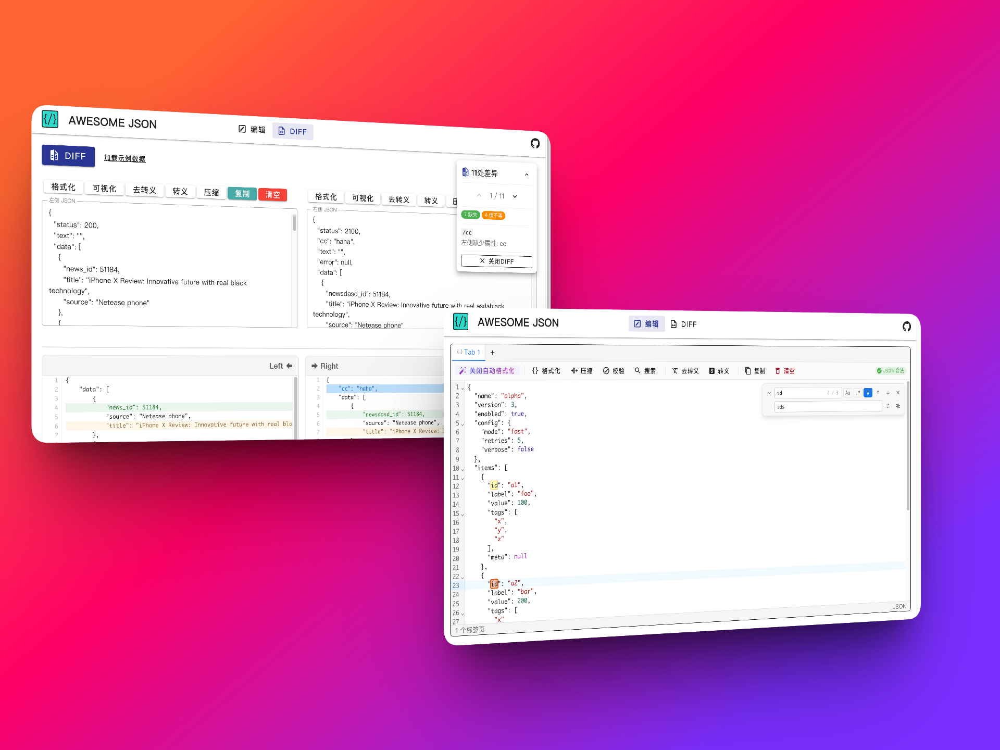
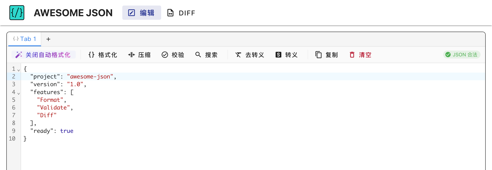
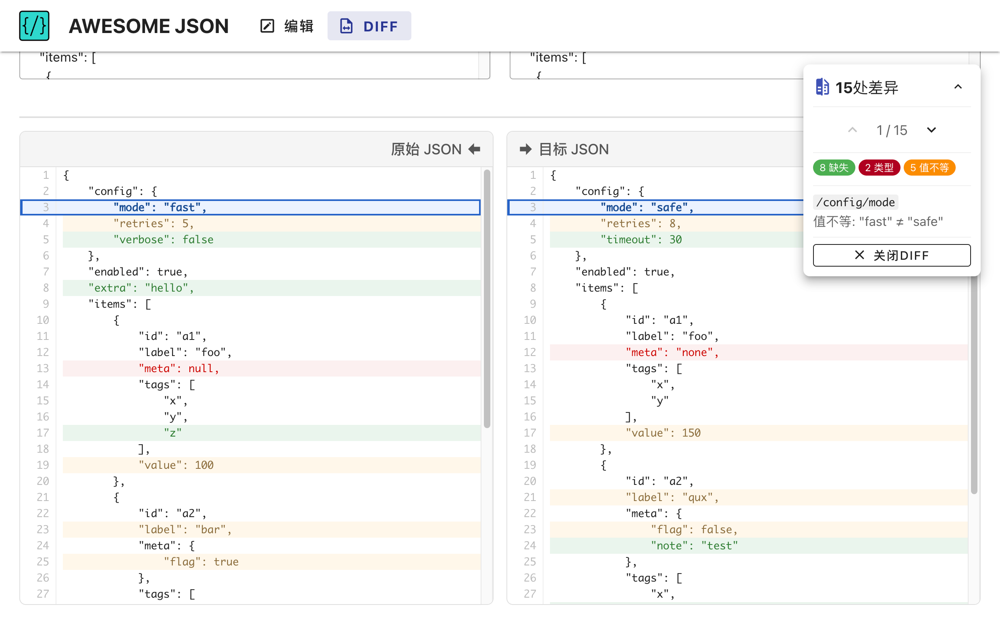

<div align="center">


# Awesome JSON

**一个顺手的 JSON 工作台。** 让编辑、校验、格式化和差异对比都更直观。

<p>
  <a href="https://awesome-json.wangyj.site/"><strong>在线体验 ↗</strong></a>
  &nbsp;·&nbsp;
  <a href="#快速开始">快速开始</a>
  &nbsp;·&nbsp;
  <a href="https://github.com/EthonWang/awesome-json/issues">反馈问题</a>
</p>

<p>
  
  
  
  
</p>



</div>

## 为什么用 Awesome JSON？

处理接口响应、配置文件或测试数据时，常常需要在编辑和对比之间来回切换。Awesome JSON 把这些常用操作放在同一个页面里：写入内容、检查语法、整理格式，再对照两份 JSON 找到真正变化的字段。数据处理在浏览器中完成。

| 编辑与整理                                                                   | 精准对比                                                     |
| :--------------------------------------------------------------------------- | :----------------------------------------------------------- |
| **多标签编辑**：并行处理多份 JSON，标签内容彼此独立。                        | **语义级 Diff**：递归比较对象和数组，定位到字段路径。        |
| **即时反馈**：语法高亮、自动补全、括号匹配、代码折叠与实时校验。             | **分类标记**：区分缺失项、类型变化和值变化，并可按类别筛选。 |
| **常用操作一键完成**：自动或手动格式化、压缩、搜索替换、转义、去转义与复制。 | **逐处查看**：并排展示结果，借助悬浮面板和快捷键跳转差异。   |

## 看看实际界面

### 编辑器

多标签工作区基于 CodeMirror 6，编辑时会提示 JSON 是否合法；自动格式化可随时开关。



### JSON Diff

在 **DIFF** 页粘贴两份 JSON，点击「开始对比」即可看到并排结果。绿色表示一侧缺失，红色表示类型不同，橙色表示值不相等；右侧面板显示差异总数、路径与详情。



> 想快速试用？进入 [在线 Diff 页面](https://awesome-json.wangyj.site/#/diff)，点击「加载示例数据」，再点击「开始对比」。

## 快速开始

需要 **Node.js 18+** 和 npm。

```bash
git clone https://github.com/EthonWang/awesome-json.git
cd awesome-json
npm ci
npm run dev
```

按终端提示打开本地地址。常用命令：

| 命令              | 作用               |
| :---------------- | :----------------- |
| `npm run dev`     | 启动开发服务器     |
| `npm run build`   | 构建到 `dist/`     |
| `npm run preview` | 在本地预览构建结果 |

项目基于 Vue 3、Vuetify 3、CodeMirror 6 和 Vite 5。构建结果是静态资源，可部署到静态站点服务。

## 操作小贴士

- 编辑器内可使用 `Ctrl/⌘ + F` 搜索，`Ctrl/⌘ + H` 打开替换。
- 查看 Diff 结果时，焦点不在输入框或按钮上，可以用 `N` / `→` 跳到下一处，`P` / `←` 返回上一处。
- 修改对比输入后，点击「重新对比」刷新结果。

## 参与贡献

欢迎通过 [Issue](https://github.com/EthonWang/awesome-json/issues) 报告问题或提出想法，也欢迎提交 Pull Request。修改前可先运行 `npm run build` 检查项目能否正常构建。

<div align="center">

如果 Awesome JSON 对你有帮助，欢迎点个 ⭐ Star。

</div>
